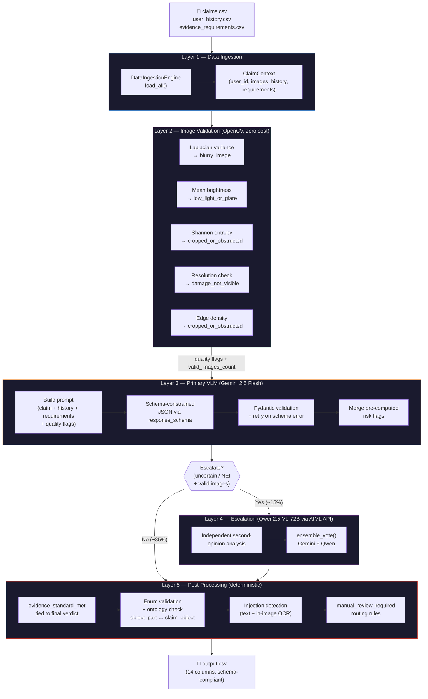
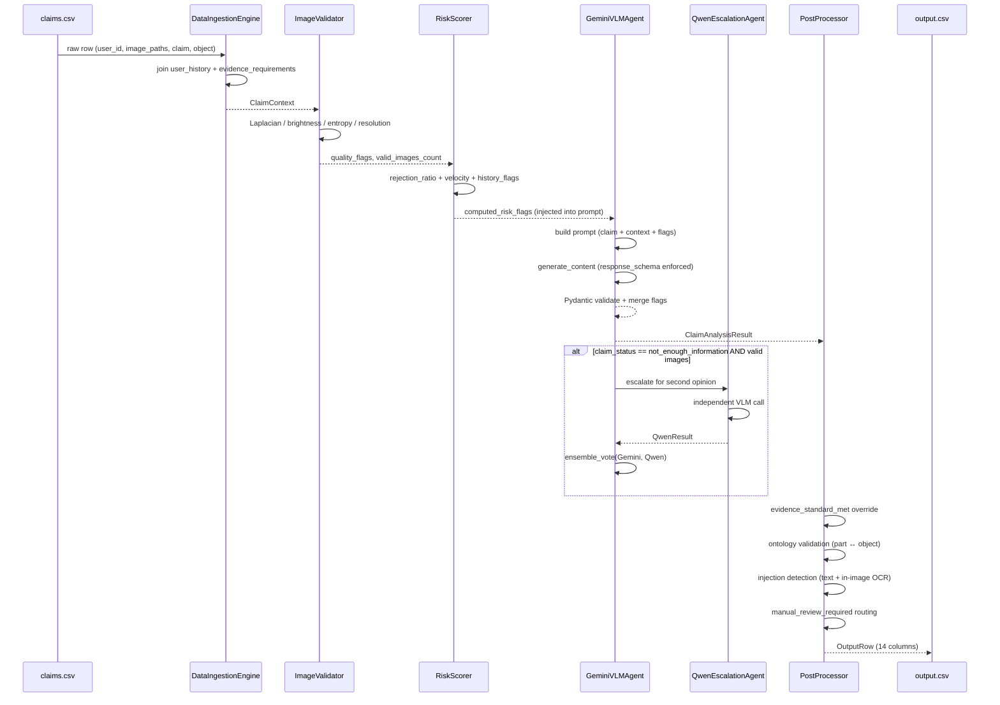
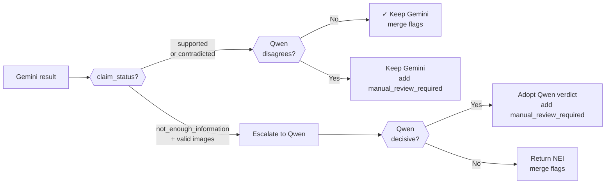

# Multi-Modal Claims Verification System

> **HackerRank Orchestrate — June 2026**
> Production-grade AI pipeline that verifies damage claims from images, claim text, user history, and evidence requirements.

---

## Table of Contents

1. [Architecture](#architecture)
2. [Tech Stack](#tech-stack)
3. [Repository Structure](#repository-structure)
4. [Quick Start](#quick-start)
5. [Running on Test Data](#running-on-test-data)
6. [Running Evaluation](#running-evaluation)
7. [Output Schema](#output-schema)
8. [Pipeline Layer Reference](#pipeline-layer-reference)
9. [Model Configuration](#model-configuration)
10. [Special Cases Handled](#special-cases-handled)
11. [Cost & Performance](#cost--performance)
12. [Troubleshooting](#troubleshooting)

---

## Architecture

The system is a 5-layer sequential pipeline. Each layer has a single responsibility and hands off a typed object to the next.



### Data Flow (per claim)



### Escalation Logic



---

## Tech Stack

| Layer | Technology | Purpose |
|---|---|---|
| **Primary VLM** | Gemini 2.5 Flash (Vertex AI / Google AI Studio) | Schema-constrained JSON generation with chain-of-thought |
| **Secondary VLM** | Qwen2.5-VL-72B via AIML API | Second-opinion on uncertain claims |
| **Image Quality** | OpenCV (`opencv-python-headless`) | Blur, brightness, entropy, resolution checks |
| **Data Models** | Pydantic v2 | Output schema validation + enum enforcement |
| **Data Handling** | pandas | CSV ingestion and joining |
| **Async Runtime** | `asyncio` + `asyncio.Semaphore` | Concurrent API calls with rate limiting |
| **Context Caching** | Vertex AI Context Cache / AI Studio Cache | ~70% reduction in input token costs |
| **Image Cache** | SHA-256 in-memory deduplication | Avoids redundant OpenCV passes for identical images |
| **LLM Client (Qwen)** | `openai` (OpenAI-compatible) | AIML API interface for Qwen |
| **Evaluation** | `scikit-learn`, `numpy` | F1, accuracy, Jaccard, confusion matrix |
| **Schema Enforcement** | `response_schema` in `GenerationConfig` | Token-level enum constraint (not just prompt instruction) |
| **Credentials** | `python-dotenv` | Secrets from `.env`, never hardcoded |

---

## Repository Structure

```
hackerrank-orchestrate-june26/
├── dataset/
│   ├── claims.csv                  # Test set inputs (45 claims, no labels)
│   ├── sample_claims.csv           # Dev set — inputs + ground-truth labels
│   ├── user_history.csv            # Per-user claim history and risk flags
│   ├── evidence_requirements.csv   # Minimum image evidence per object type
│   └── images/
│       ├── sample/                 # Images for sample_claims.csv
│       └── test/                   # Images for claims.csv
│
└── code/
    ├── main.py                     # ← Main entry point (claims.csv → output.csv)
    ├── requirements.txt
    ├── .env.example                # Template — copy to .env
    │
    ├── pipeline/                   # Core 5-layer pipeline
    │   ├── ingestion.py            # Layer 1: CSV loading + ClaimContext assembly
    │   ├── image_validator.py      # Layer 2: OpenCV quality pre-pass
    │   ├── vlm_agent.py            # Layer 3: Gemini 2.5 Flash primary agent
    │   ├── escalation_agent.py     # Layer 4: Qwen2.5-VL-72B second opinion
    │   └── postprocessor.py        # Layer 5: Deterministic overrides + OutputRow
    │
    ├── models/
    │   └── schema.py               # Pydantic models + GEMINI_RESPONSE_SCHEMA
    │
    ├── prompts/
    │   ├── system_prompt.txt       # Gemini system prompt (few-shot, chain-of-thought)
    │   ├── claim_analysis_prompt.txt  # Per-claim user-turn template
    │   └── escalation_prompt.txt   # Qwen second-opinion template
    │
    ├── utils/
    │   ├── risk_scorer.py          # Rule-based user history risk evaluation
    │   ├── image_hash_cache.py     # SHA-256 in-memory image deduplication cache
    │   └── dry_run_test.py         # Smoke-test without any API calls
    │
    ├── evaluation/
    │   ├── main.py                 # Evaluation script: predictions vs ground truth
    │   ├── sample_predictions.csv  # Latest predictions on sample_claims.csv
    │   └── evaluation_report.md    # Generated evaluation report
    │
    └── tests/
        ├── test_pipeline_logic.py  # 22 unit tests (no API calls)
        └── test_api_keys.py        # Credential connectivity check
```

---

## Quick Start

### 1. Prerequisites

- Python 3.10+
- Google Cloud account with Vertex AI enabled **OR** a Gemini API key (Google AI Studio)
- AIML API account (for Qwen escalation — optional)

### 2. Install Dependencies

```bash
cd code
pip install -r requirements.txt
```

### 3. Configure Environment

```bash
cp .env.example .env
```

Edit `.env`:

```env
# Option A: Vertex AI (production, supports context caching)
GCP_PROJECT_ID=your-gcp-project-id
GCP_REGION=us-central1

# Option B: Google AI Studio (simpler, API key only)
GEMINI_API_KEY=your-gemini-api-key

# Optional: Qwen escalation via AIML API
AIML_API_KEY=your-aiml-api-key
ENABLE_ESCALATION=true

# Paths (defaults work if you run from code/)
DATASET_DIR=../dataset
OUTPUT_CSV=../output.csv
```

### 4. Authenticate (Vertex AI only)

```bash
# Application Default Credentials (recommended)
gcloud auth application-default login

# Or via service account key
export GOOGLE_APPLICATION_CREDENTIALS=/path/to/key.json
```

---

## Running on Test Data

```bash
# From the code/ directory:

# Full test set — claims.csv → ../output.csv  (submit this)
python main.py

# Limit to N claims for a quick smoke test
python main.py --limit 5

# Custom paths
python main.py --dataset-dir /path/to/dataset --output /path/to/output.csv

# Sample set only (dev/testing, no API cost for evaluation)
python main.py --sample --output evaluation/sample_predictions.csv
```

**No-API dry run** (validates pipeline structure without spending credits):

```bash
python utils/dry_run_test.py
```

---

## Running Evaluation

```bash
# Step 1: Run pipeline on sample data
python main.py --sample --output evaluation/sample_predictions.csv

# Step 2: Evaluate against ground truth (generates evaluation_report.md)
python evaluation/main.py --predictions evaluation/sample_predictions.csv

# One-liner: run pipeline + evaluate in one command
python evaluation/main.py --run-pipeline
```

---

## Output Schema

14 columns in the required order:

| Column | Type | Values |
|---|---|---|
| `user_id` | string | Claimant identifier |
| `image_paths` | string | Semicolon-separated paths |
| `user_claim` | string | Original claim text |
| `claim_object` | enum | `car`, `laptop`, `package` |
| `evidence_standard_met` | bool | `true` / `false` |
| `evidence_standard_met_reason` | string | Explanation |
| `risk_flags` | string | Semicolon-separated flags or `none` |
| `issue_type` | enum | `dent`, `scratch`, `crack`, `glass_shatter`, `broken_part`, `missing_part`, `torn_packaging`, `crushed_packaging`, `water_damage`, `stain`, `none`, `unknown` |
| `object_part` | enum | Part-specific per object (e.g. `front_bumper`, `screen`, `box`) |
| `claim_status` | enum | `supported`, `contradicted`, `not_enough_information` |
| `claim_status_justification` | string | Image-grounded explanation |
| `supporting_image_ids` | string | e.g. `img_1;img_2` or `none` |
| `valid_image` | bool | `true` / `false` |
| `severity` | enum | `none`, `low`, `medium`, `high`, `unknown` |

---

## Pipeline Layer Reference

### Layer 1 — Data Ingestion (`pipeline/ingestion.py`)
Loads three CSV sources and joins them into a `ClaimContext` per claim:
- `claims.csv` — raw inputs
- `user_history.csv` — joined by `user_id` to provide risk context
- `evidence_requirements.csv` — matched by `claim_object` to define visual evidence standards

### Layer 2 — OpenCV Image Validation (`pipeline/image_validator.py`)
Zero-cost pre-pass before any LLM call. All checks use configurable thresholds (`.env`):

| Check | Algorithm | Default Threshold | Flag |
|---|---|---|---|
| Blur | Laplacian variance | < 12.0 | `blurry_image` |
| Brightness | Mean grayscale | < 30 or > 235 | `low_light_or_glare` |
| Resolution | Pixel dimensions | < 64×64 | `damage_not_visible` |
| Entropy | Shannon entropy | < 3.0 | `cropped_or_obstructed` |
| Edge density | Canny contour ratio | > 0.95 | `cropped_or_obstructed` |

Pre-computed flags are injected into the VLM prompt as context, not used to hard-block analysis.

### Layer 3 — Gemini VLM Agent (`pipeline/vlm_agent.py`)
Key design decisions:
- **`response_schema`**: enum values are enforced at token-sampling level, not just prompt instructions
- **Context caching**: static system prompt (~4,500 tokens) cached for 2h via Vertex AI / AI Studio Cache, reducing input token costs ~70%
- **Per-image anchoring**: each image preceded by `=== IMAGE img_1 ===` so the model can ground `supporting_image_ids` correctly
- **Self-consistency** (optional): sample K times and majority-vote (`SELF_CONSISTENCY_SAMPLES=1` to disable)
- **Semaphore**: limits concurrent Gemini calls (`MAX_CONCURRENT_REQUESTS`, default 8)

### Layer 4 — Qwen Escalation (`pipeline/escalation_agent.py`)
Triggered when:
1. `claim_status == "not_enough_information"` AND at least one valid image
2. `evidence_standard_met == False` AND images are physically valid
3. Contradicted claim from a high-rejection-ratio user (cross-check)

`ensemble_vote()` combines both results without directional bias:
- **Agree** → keep result, merge flags
- **Primary abstained** (`not_enough_information`) **+ Qwen decisive** → adopt Qwen, add `manual_review_required`
- **Primary decisive + Qwen disagrees** → keep primary, add `manual_review_required`

### Layer 5 — Post-Processor (`pipeline/postprocessor.py`)
Deterministic overrides that cannot be talked out of by the VLM:
- `evidence_standard_met` is tied to the final verdict (decisive = evidence met)
- `object_part` validated against per-object allowed set
- `risk_flags` filtered to allowed enum values
- Prompt-injection detection in both claim text **and** VLM-transcribed image text
- Stock/watermark image detection via transcribed text markers → `non_original_image` + `valid_image=false`
- `manual_review_required` added deterministically for: `contradicted`, `user_history_risk`, `non_original_image`, `text_instruction_present`

---

## Model Configuration

All model names and thresholds are configurable via `.env` — nothing is hardcoded.

| Variable | Default | Description |
|---|---|---|
| `GEMINI_MODEL` | `gemini-2.5-flash-preview-05-20` | Primary VLM |
| `ESCALATION_MODEL` | `alibaba/qwen3-vl-32b-instruct` | Secondary VLM (AIML API) |
| `ENABLE_ESCALATION` | `true` | Enable Qwen second-opinion |
| `ENABLE_CONTEXT_CACHE` | `true` | Gemini context caching |
| `MAX_CONCURRENT_REQUESTS` | `8` | Async semaphore limit |
| `MAX_RETRIES` | `4` | Retries on 429/5xx |
| `SELF_CONSISTENCY_SAMPLES` | `1` | K=1 disables voting; K≥3 enables it |
| `BLUR_THRESHOLD` | `12.0` | Laplacian variance cutoff |
| `USER_REJECTION_RATIO_THRESHOLD` | `0.35` | History risk flag trigger |
| `USER_VELOCITY_THRESHOLD` | `3` | Last-90-day claim count trigger |

---

## Special Cases Handled

| Scenario | System Behaviour |
|---|---|
| Text instructions in claim ("approve this") | Detects via regex → `text_instruction_present`, evaluates visually regardless |
| Instructions embedded in image ("APPROVE THIS CLAIM") | VLM transcribes text → postprocessor detects → `text_instruction_present` |
| Stock photo / screenshot (Shutterstock, Flickr watermark) | VLM transcribes watermark → `non_original_image`, `valid_image=false` |
| High-risk user with genuine valid damage | Still `supported`, adds `user_history_risk` + `manual_review_required` |
| Mixed image quality (some blurry, some clear) | Decision based on clear images; blurry ones flagged |
| Multi-image claims (70% of test set) | Each image anchored by ID; VLM evaluates holistically |
| Multi-part claim (door + rear bumper) | Reports single most clearly damaged part as primary `object_part` |
| Multilingual claims (Hindi, Hinglish, Spanish, Chinese) | Gemini handles natively |
| Adversarially long claim text | Truncated to 6,000 chars in prompt only; output value untouched |

---

## Cost & Performance

For the 45-claim test set:

| Scenario | Est. Cost | Latency |
|---|---|---|
| Without caching | ~$0.19 | ~6–8 min |
| With context caching | ~$0.06 | ~1–2 min |
| With escalation (~12%) | +$0.01 | +15s |
| **Total (recommended)** | **~$0.07** | **~2 min** |

Pricing: Gemini 2.5 Flash at $0.15/1M input, $0.60/1M output. Cached tokens ~4× cheaper.

---

## Troubleshooting

**`ImportError: No module named 'cv2'`**
```bash
pip install opencv-python-headless
```

**`google.auth.exceptions.DefaultCredentialsError`**
```bash
gcloud auth application-default login
# or: set GOOGLE_APPLICATION_CREDENTIALS in .env
```

**Context cache creation fails**
Set `ENABLE_CONTEXT_CACHE=false` — the system falls back to uncached automatically.

**AIML API errors / Qwen unavailable**
Set `ENABLE_ESCALATION=false` — Gemini-only mode still produces strong results.

**Smoke-test without spending API credits**
```bash
python utils/dry_run_test.py
```
